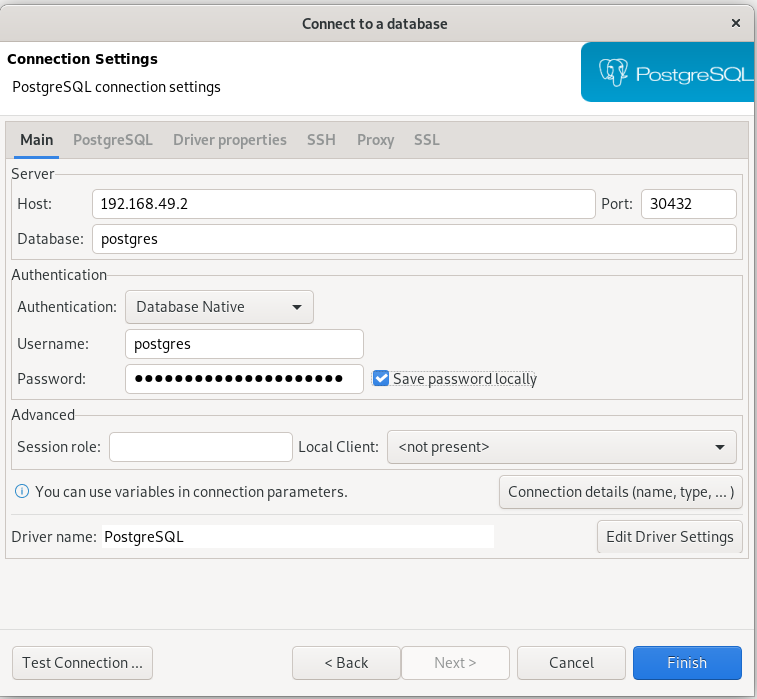

# More on Storage

* Kubernetes [Storage documentation](https://kubernetes.io/docs/concepts/storage/).

## PersistentVolume

* [Kubernetes.io Persistent Volumes](https://kubernetes.io/docs/concepts/storage/persistent-volumes/)
* [Minikube Persistent Volumes](https://minikube.sigs.k8s.io/docs/handbook/persistent_volumes/)
* [Create a PersistentVolume](https://kubernetes.io/docs/tasks/configure-pod-container/configure-persistent-volume-storage/#create-a-persistentvolume)


Apply [pvol000-pv.yaml](./pvol000-pv.yaml):
```
kubectl apply -f pvol000-pv.yaml
kubectl describe persistentvolume/pvol000
```

## PersistentVolumeClaim

* [PersistentVolumeClaims](https://kubernetes.io/docs/concepts/storage/persistent-volumes/#persistentvolumeclaims)
* [Create a PersistentVolumeClaim](https://kubernetes.io/docs/tasks/configure-pod-container/configure-persistent-volume-storage/#create-a-persistentvolume)

Apply [pvol000-pv-claim.yaml](pvol000-pv-claim.yaml):
```
kubectl apply -f pvol000-pv-claim.yaml
kubectl describe persistentvolumeclaim/pvol000-pv-claim
```

## Using a PersistentVolumeClaim

* [Claims As Volumes](https://kubernetes.io/docs/concepts/storage/persistent-volumes/#claims-as-volumes)


Apply [postgres-deployment.yaml](postgres-deployment.yaml):
```
kubectl apply -f postgres-deployment.yaml
kubectl get pvc,pv,pods,svc,deployment
kubectl describe deployment.apps/postgres
kubectl describe service/postgres
minikube service list
```

Explore:
* Using a SQL client like [DBeaver](https://dbeaver.io/download/), connect to the database using the password "Use-a-Better-Passw0rd" along with the IP address and port number from the service list above:



* Verify this query `select * from products;` fails with a products table does not exist error.
* Run this script in a new SQL Editor:
  ```
  drop table if exists products;

  CREATE TABLE products (
      product_no integer,
      name text,
      price numeric
  );

  INSERT INTO products (product_no, name, price) VALUES
      (1, 'Cheese', 9.99),
      (2, 'Bread', 1.99),
      (3, 'Milk', 2.99);
  ```
* Verify the table has data: `select * from products;`
* Disconnect from the database
* Scale down to zero to kill the pod: 
  ```
  kubectl scale deployment.apps/postgres --replicas=0
  kubectl get all --show-labels
  ```

* Scale back to 1 instance:
  ```
  kubectl scale deployment.apps/postgres --replicas=1
  kubectl get all --show-labels
  ```

* In DBeaver, reconnect to the database
* Verify the table still exists and has data: `select * from products;`
* Quit DBeaver

## Clean up

```
kubectl get pvc,pv,pods,svc,deployment
kubectl delete deployment.apps/postgres service/postgres
kubectl get pvc,pv,pods,svc,deployment
kubectl delete persistentvolumeclaim/pvol000-pv-claim
kubectl get pvc,pv,pods,svc,deployment
kubectl delete persistentvolume/pvol000
```

# Passing configuration as file data

## Using ephemeral volumes

Mount various configuration data using different volumes into multiple directories

References:
* [Ephemeral Volumes](https://kubernetes.io/docs/concepts/storage/ephemeral-volumes/)
* [ConfigMaps](https://kubernetes.io/docs/concepts/configuration/configmap/)
* [Secrets](https://kubernetes.io/docs/concepts/configuration/secret/)
* [Expose Pod Information to Containers Through Files](https://kubernetes.io/docs/tasks/inject-data-application/downward-api-volume-expose-pod-information/)

Apply [ephemeral-vol-test-pod.yaml](./ephemeral-vol-test-pod.yaml):
```
kubectl apply -f ephemeral-vol-test-pod.yaml
kubectl get all,cm,secrets
```

Explore:
* Shell in and look around with `kubectl exec -it ephemeral-vol-test -- /bin/sh` or run the commands below:

  ```
  kubectl exec -it ephemeral-vol-test -- ls -lR /configuration/

  kubectl exec -it ephemeral-vol-test -- find /configuration/ -type f -exec echo "contents of" {} ":" \; -exec cat {} \; -exec echo "" \;
  ```

* Clean up:

  ```
  kubectl get all,cm,secrets

  kubectl delete pod/ephemeral-vol-test
  kubectl delete secret db-secrets
  kubectl delete configmap/config-map-demo
  ```


## Using Projected volumes

Mount various configuration data using projected volumes into a common directory

References:
* [Projected Volumes](https://kubernetes.io/docs/concepts/storage/projected-volumes/)

Apply [projected-vol-test-pod.yaml](projected-vol-test-pod.yaml):

```
kubectl apply -f projected-vol-test-pod.yaml
```

Explore:
* Shell in and look around with `kubectl exec -it projected-vol-test -- /bin/sh` or run the commands below.

  ```
  kubectl exec -it projected-vol-test -- ls -lR /configuration/
  kubectl exec -it projected-vol-test -- ls -lR /configuration/..data/
  ```

* Print the file name and contents of all configuration data:
  ```
  kubectl exec -it projected-vol-test -- find /configuration/ -type f -exec echo "contents of" {} ":" \; -exec cat {} \; -exec echo "" \;
  ```

* Examine only the secrets:

  ```
  kubectl exec -it projected-vol-test -- cat /configuration/db/password; echo ""
  kubectl exec -it projected-vol-test -- cat /configuration/db/username; echo ""
  ```

* Examine only the config from downwardAPI:

  ```
  kubectl exec -it projected-vol-test -- cat /configuration/cpu_limit; echo ""
  kubectl exec -it projected-vol-test -- cat /configuration/..data/labels; echo ""
  ```

* Examine only the config from the ConfigMap:

  ```
  kubectl exec -it projected-vol-test -- cat /configuration/..data/home_track; echo ""
  kubectl exec -it projected-vol-test -- cat /configuration/..data/meaning_of_life; echo ""
  kubectl exec -it projected-vol-test -- cat /configuration/..data/race.properties
  ```

* Clean up:

  ```
  kubectl get all,cm,secrets

  kubectl delete pod projected-vol-test
  kubectl delete secret db-secrets
  kubectl delete configmap/config-map-demo
  ```

# Passing configuration as environment variables


References:
* [Expose Pod Information to Containers Through Environment Variables](https://kubernetes.io/docs/tasks/inject-data-application/environment-variable-expose-pod-information/)

Apply [env-vars-test-pod.yaml](./env-vars-test-pod.yaml):

```
kubectl apply -f env-vars-test-pod.yaml
kubectl get all,pvc,cm,secrets
```

Explore:
* Shell in and look around with `kubectl exec -it environment-vol-test -- /bin/sh` or run the commands below.

  ```
  kubectl exec -it environment-vol-test -- printenv
  ```

* Clean up:
  ```
  kubectl delete secret/db-secrets configmap/config-map-demo pod/environment-vol-test
  kubectl get all,pvc,cm,secrets
  ```
